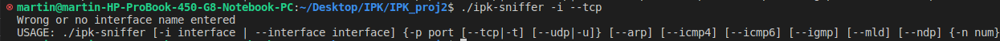

 # IPK Project 2: Network sniffer
## Description of the implementation
The application is implemented in the C# programming language with the **.NET 6.0** framework using libraries from the **base SDK** (NET SDK).  The compilation is done using a **Makefile** (*dotnet clean, build and publish*) and the `make` command (`make OS=win-x64` for windows). It has been tested to run on Windows 11, Ubuntu 22.04 and NIX operating system. The client consists of 2 classes: `Sniffer`, `Error`. Note that this application requires root privileges to capture network traffic.

### Requirements
To use this application, you will need the following:

 - C# compiler with .NET 6.0 Framework
 - SharpPcap library
 - PacketDotNet library

### Command Line Arguments
`./ipk-sniffer [-i interface | --interface interface] {-p port [--tcp|-t] [--udp|-u]} [--arp] [--icmp4] [--icmp6] [--igmp] [--mld] [--ndp] {-n num}`

Arguments can be in any order and unless protocols are explicitly specified, all protocols are considered for printing.

`-i|--interface interface` - interface to sniff, if this parameter is not specified or name of interface is not specified, list of avaible interfaces is printed
`--tcp|-t` - display TCP segments
`--udp|-u` - display UDP datagrams
`-p port` - extends TCP and UDP protocols, can be used as source and destination part, it has to be used as combination with `--tcp|-t` or `--udp|-u `
`--arp` - display ARP frames
`--icmp4` - display ICMPv4 echo   
`--icmp6` - display ICMPv6 echo
`--ndp` - display NDP packet
`--igmp` - display IGMP packet
`--mld` - display MLD packet
`-n num` - number of packets to display, if not specified, display 1 packet

## Sniffer class

The Sniffer class contains the main class of the application.
The `argument_handling()` method is responsible for parsing the command-line arguments and returning the necessary values for packet filtering and handling. The method returns a tuple containing the filter string, the name of the interface, the number of packets to capture, and a boolean flag indicating whether to print the list of available network interfaces.

The `print_all_interfaces()` method prints the name of all available network interfaces and exits the application.

The `port_handling()` method adds the specified port number to the UDP or TCP protocol filter, depending on which one is present. If none of them is present, the method raises an error.

Finally, the application captures packets using the `CaptureDevice` class from the `SharpPcap` library and analyzes them using the Packet class from the PacketDotNet library. After that, application initializes the network interface and starts capturing packets. For each captured packet, it prints the packet information, including source and destination MAC addresses, source and destination IP addresses, hexdump of packet.

## Error class
This class is responsible for handling errors that may occur during the execution of the application. Method `print_error()` takes an integer error code as its parameter and prints the appropriate error message to the standard error stream. After printing the error message, it also prints the usage information for the Network_sniffer program and exits the program with the specified error code.

|Error Code	| Error Message                                                                         |
|-----------|---------------------------------------------------------------------------------------|
| 1	        | Wrong argument entered                                                                |
| 2	        | Wrong or no port number after -p                                                      |
| 3	        | Entered port without using --tcp\|-t or --udp\|-u                                     |
| 4	        | Wrong or no number after -n                                                           |
| 5	        | Wrong or no interface name entered                                                    |
| 6	        | Interface wasn't opened. Maybe you are not launching program with root permission?    |
| 7	        | You can't enter arguments more times                                                  |
| 99	    | Internal Error                                                                        |

## Structure of packets

### TCP packet header structure [1]
| Field                 | Length    | Description                                                                           |
|-----------------------|-----------|---------------------------------------------------------------------------------------|
| Source Port           | 2 bytes   | The port number on the sender's device                                                |
| Destination Port      | 2 bytes   | The port number on the recipient's device                                             |
| Sequence Number       | 4 bytes   | Used to keep track of the order of data packets sent between the sender and recipient |
| Acknowledgment Number | 4 bytes   | Used to acknowledge receipt of data packets by the recipient                          |
| Data Offset           | 4 bits   | Size of the TCP header                                                                |
| Reserved              | 6 bits   | These bits are reserved for future use                                                |
| Flags                 | 6 bits   | This field contains several flags that control the behavior                           |
| Window Size           | 2 bytes   | The number of bytes the sender is willing to receive before it expects an ACK         |
| Checksum              | 2 bytes   | This is used to detect errors                                                         |
| Urgent Pointer        | 2 bytes   | This is used to indicate the location of urgent data                                  |
| Options               | variable  | Additional TCP options                                                                |

### UDP packet header structure [2]
| Field             | Length    | Description                               |
|-------------------|-----------|-------------------------------------------|
| Source Port       | 2 bytes   | The port number on the sender's device    |
| Destination Port  | 2 bytes   | The port number on the recipient's device |
| Length            | 2 bytes   | The length of the entire UDP packet       |
| Checksum          | 2 bytes   | This is used to detect errors             |

### ICMP packet header structure [3]
| Field     | Length    | Description                               |
|-----------|-----------|-------------------------------------------|
| Type      | 1 byte    | The port number on the sender's device    |
| Code      | 1 byte    | The port number on the recipient's device |
| Checksum  | 2 bytes   | The length of the entire UDP packet       |

### ARP frame structure [4]
| Field                 | Size      | Description                                                   |
|-----------------------|-----------|---------------------------------------------------------------|
| Hardware Type         | 2 bytes   | Specifies the type of NIC hardware being used                 |
| Protocol Type         | 2 bytes   | Specifies the type of protocol addresses in upper protocol    |
| Hardware length       | 1 byte    | Specifies the length of the hardware address                  |
| Protocol length       | 1 byte    | Specifies the length of the protocol address                  |
| Operation             | 2 bytes   | Specifies the type of ARP packet, such as request or reply    |
| Source HW Address     | 6 bytes   | Specifies the sender's hardware address                       |
| Source Prot. Address  | 4 bytes   | Specifies the sender's protocol address                       |
| Target HW Address     | 6 bytes   | Specifies the target's hardware address                       |
| Target Prot. Address  | 4 bytes   | Specifies the target's protocol address                       |

## Testing
Testing was performed on three operating systems: Windows 11 (win-x64), Nix OS and Ubuntu 22.04 (linux-x64). On the left is output of application, on the right is comparison with wireshark application.

## Ubuntu 22.04 
### (Tests with correct input)

`./ipk-sniffer -i wlp0s20f3 -arp`

`./ipk-sniffer -i wlp0s20f3 -arp`

`./ipk-sniffer -i wlp0s20f3 -icmpv4`

`./ipk-sniffer -i wlp0s20f3 -tcp -p 443`

`./ipk-sniffer -i wlp0s20f3 -tcp`

`./ipk-sniffer -i wlp0s20f3 -udp`

`./ipk-sniffer -i wlp0s20f3 -igmp`

### Tests with incorrect input or other error
**Wrong format of port** (`./ipk-sniffer -i lo --tcp -p io`)

**Duplicate argument** (`./ipk-sniffer -i -i`)

**No interface name entered** (`./ipk-sniffer -i --tcp`)

**Port without TCP and UDP** (`./ipk-sniffer -i lo --icmpv4 -p 85`)

**No root permission** (`./ipk-sniffer -i lo --tcp`)

## NIX
`./ipk-sniffer -i enp03s -igmp`

`./ipk-sniffer -i enp03s -imcpv6`

`./ipk-sniffer -i enp03s -udp`

`./ipk-sniffer -i enp03s -tcp`

`./ipk-sniffer -i enp03s-ndp`

## Bibliography

 - [1][Transmission Control Protocol (TCP)](https://www.khanacademy.org/computing/computers-and-internet/xcae6f4a7ff015e7d:the-internet/xcae6f4a7ff015e7d:transporting-packets/a/transmission-control-protocol--tcp#:~:text=Packet%20format&text=The%20IP%20data%20section%20is,size%20of%20the%20options%20field) - _Khan Academy_. Accessed 16 Apr. 2023.
 - [2][UDP Protocol | User Datagram Protocol](https://www.javatpoint.com/udp-protocol#:~:text=UDP%20Header%20Format,would%20be%2065%2C535%20minus%2020) - _Javatpoint_. Accessed 16 Apr. 2023.
 - [3][What Is ICMP Protocol.](https://www.tutorialspoint.com/what-is-icmp-protocol#:~:text=ICMP%20Message%20Format,255%20are%20the%20data%20messages) - _Online Courses and EBooks Library_. Accessed 16 Apr. 2023.
 - [4][Address Resolution Protocol (ARP)](http://www.cs.newpaltz.edu/~easwaran/CCN/Week13/ARP.pdf) - _Newpaltz_. Accessed 16 Apr. 2023.
 -  [NESFIT/IPK-Projekty - IPK-Projekty - FIT - VUT Brno - Git.](https://git.fit.vutbr.cz/NESFIT/IPK-Projekty/src/branch/master) _FIT - VUT Brno - Git_. Accessed 21 Mar. 2023.

